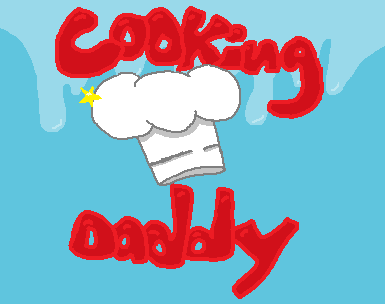
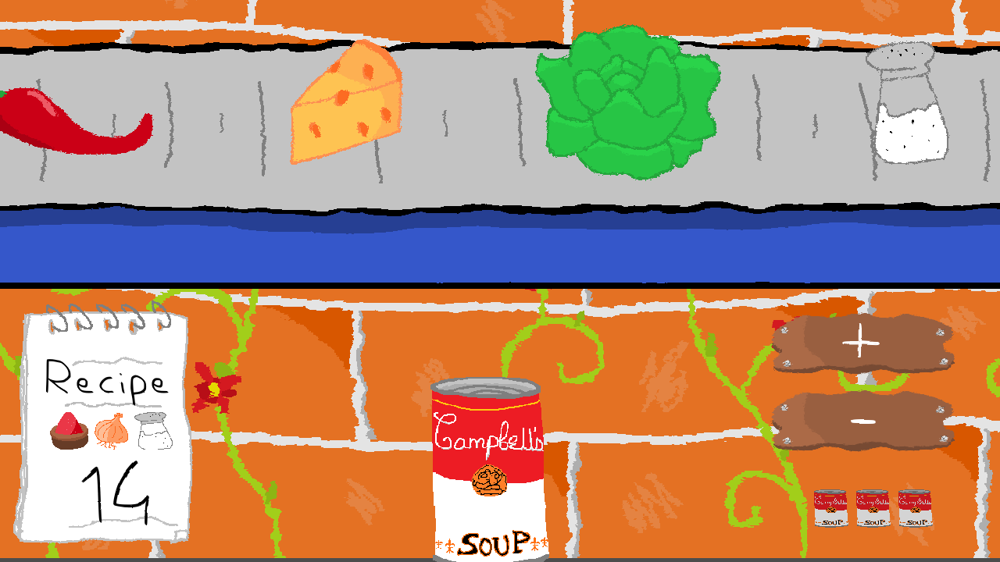
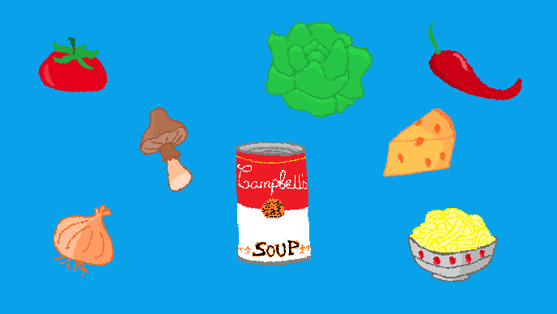

#  Cooking Daddy

[![release][1]][2] [![license][7]][8]

Cooking Daddy is a **JAM game** for 💻**PC** / 🌐**Web**.

[Paint jam 2021](https://itch.io/jam/paint-jam-2021) theme is `only MS Paint` and `Campbell's Soup`.

##  Play on itch.io

Play at **[greendjango.itch.io](https://greendjango.itch.io/cooking-daddy)**

## Install & Setup

1. Download the 💻*binary* from **[releases](https://github.com/GreenDjango/PaintJam2021/releases)**
2. Run the app
3. Enjoy with `Cooking Daddy` !
4. Optional: `rm -rf *` for delete all your pc

---

#### Project realised by:
- **[@Killian D.](https://github.com/kiiks)** 🐧
- **[@Louis C.](https://github.com/Kdaudau)** 🦦
- **[@Théo C.](https://github.com/GreenDjango)** 🐙

[1]: https://img.shields.io/badge/release-v0.1.0-blue
[2]: https://github.com/GreenDjango/PaintJam2021/releases 'GitHub release (latest by date)'
[7]: https://img.shields.io/badge/license-MIT-green
[8]: https://github.com/GreenDjango/PaintJam2021/blob/master/LICENSE 'GitHub license'
